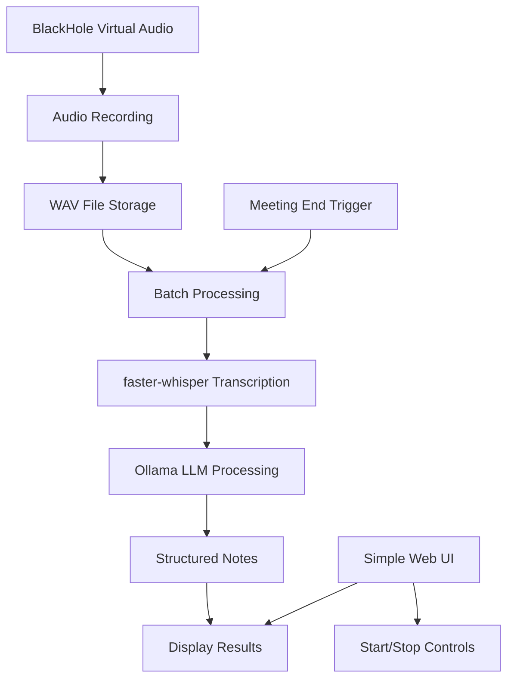

# Design Document

## Overview

The AI Meeting Notes application is a simplified Python-based system optimized for personal use on macOS with Google Meet/Teams/Zoom. Instead of complex real-time processing, it uses a sequential batch approach: capture audio during meetings, then process everything after the meeting ends. This eliminates the memory and performance constraints of running multiple AI models simultaneously.

## Architecture



Sequential processing eliminates memory constraints and real-time complexity while maintaining privacy through local processing.

## Components and Interfaces

### 1. Audio Recording Service (`audio_recorder.py`)

**Technology Stack:**
- `sounddevice` for audio input from BlackHole virtual device
- Direct WAV file writing with automatic file management
- Built-in device detection and validation

**Setup Workflow:**
1. One-time BlackHole installation on macOS
2. Create Multi-Output Device in Audio MIDI Setup (combines speakers + BlackHole)
3. Set Multi-Output Device as system output during meetings
4. User hears meeting audio normally while BlackHole captures it
5. Application records from BlackHole input device
6. Fallback: Clear setup instructions if BlackHole not found

**Audio Routing Solution:**
- **Multi-Output Device**: Combines user's speakers/headphones with BlackHole
- **User Experience**: Normal audio playback + simultaneous recording
- **Setup Guide**: Built-in instructions for creating Multi-Output Device

**Key Classes:**
- `AudioRecorder`: File-based recording with device validation
- `RecordingSession`: Manages audio file lifecycle and cleanup

**Interface:**
```python
class AudioRecorder:
    def check_blackhole_available(self) -> bool
    def check_multi_output_setup(self) -> bool
    def get_setup_instructions(self) -> str
    def start_recording(self, filename: str) -> None
    def stop_recording(self) -> str  # Returns file path
    def is_recording(self) -> bool
    def get_recording_duration(self) -> float
```

### 2. Batch Transcription Service (`transcription.py`)

**Technology Stack:**
- `faster-whisper` (4x performance improvement over standard Whisper)
- Expected processing time: ~2-3 minutes for 1-hour meeting
- Automatic retry logic with error preservation

**Key Classes:**
- `BatchTranscriber`: Processes complete audio files with progress tracking
- `TranscriptResult`: Full transcript with metadata and confidence scores

**Interface:**
```python
class BatchTranscriber:
    def transcribe_file(self, audio_file: str) -> TranscriptResult
    def get_progress(self) -> float  # Progress percentage for UI
    def retry_transcription(self, audio_file: str) -> TranscriptResult
    def estimate_processing_time(self, audio_duration: float) -> float
```

### 3. Notes Generation Service (`notes_generator.py`)

**Technology Stack:**
- `ollama` with llama3.1:8b model (good balance of quality/speed)
- Expected processing time: ~1-2 minutes for notes generation
- Automatic retry with transcript preservation on failure

**Key Classes:**
- `NotesGenerator`: Processes complete transcripts with error recovery
- `MeetingNotes`: Pydantic model for structured output

**Interface:**
```python
class NotesGenerator:
    def generate_notes(self, transcript: str) -> MeetingNotes
    def retry_generation(self, transcript: str) -> MeetingNotes
    def is_processing(self) -> bool
    def check_ollama_available(self) -> bool
```

### 4. Data Models and File Management (`models.py`, `file_manager.py`)

**Technology Stack:**
- `pydantic` for data validation
- Automatic file cleanup with configurable retention
- Size limits and disk space monitoring

**File Management Strategy:**
- Audio files saved immediately when recording stops
- Automatic cleanup after successful processing (configurable)
- Size limit warnings for recordings >2 hours
- Manual cleanup option in web interface
- Preserve files on processing failures for retry

**Key Models:**
```python
class MeetingSession:
    start_time: datetime
    audio_file: Optional[str]
    transcript: Optional[str]
    notes: Optional[MeetingNotes]
    status: str  # "idle", "recording", "transcribing", "generating_notes", "completed", "error"
    error_message: Optional[str]
    processing_progress: float

class FileManager:
    def cleanup_session_files(self, session: MeetingSession) -> None
    def check_disk_space(self) -> bool
    def get_file_size_mb(self, filepath: str) -> float
    def estimate_processing_requirements(self, audio_duration: float) -> dict
```

### 5. FastAPI Server (`main.py`, `api/`)

**Technology Stack:**
- `FastAPI` for REST API
- `uvicorn` as ASGI server
- `Jinja2` for HTML templating
- `static files` for CSS/JS assets

**API Endpoints:**
```python
# Meeting Control
POST /api/start-recording - Start audio recording
POST /api/stop-recording - Stop recording and begin processing
GET /api/status - Get current session status

# Processing Results
GET /api/transcript - Get transcription result
GET /api/notes - Get generated meeting notes

# Utilities
POST /api/clear - Clear current session
GET /api/health - System health check
```

## Data Models

### Meeting Notes Structure
```python
class MeetingNotes(BaseModel):
    meeting_info: MeetingInfo
    agenda_items: List[AgendaItem]
    discussion_points: List[DiscussionPoint]
    action_items: List[ActionItem]
    decisions: List[Decision]
    participants: List[str]
    summary: str

class AgendaItem(BaseModel):
    title: str
    description: str
    time_discussed: Optional[str]

class ActionItem(BaseModel):
    task: str
    assignee: Optional[str]
    due_date: Optional[str]
    priority: str

class DiscussionPoint(BaseModel):
    topic: str
    key_points: List[str]
    timestamp: str
```

### Configuration Schema
```python
class AppConfig(BaseModel):
    audio_config: AudioConfig
    transcription_config: TranscriptionConfig
    llm_config: LLMConfig
    server_config: ServerConfig

class AudioConfig(BaseModel):
    sample_rate: int = 16000
    channels: int = 1
    chunk_size: int = 1024
    device_id: Optional[int] = None

class TranscriptionConfig(BaseModel):
    model_name: str = "whisper-base"
    language: str = "auto"
    enable_speaker_diarization: bool = False

class LLMConfig(BaseModel):
    model_name: str = "llama3.1:8b"
    temperature: float = 0.3
    max_tokens: int = 2000
    prompt_template: str = "default"
```

## Error Handling and Recovery

### Audio Recording Errors
- BlackHole not available: Clear setup instructions with download links
- Permission denied: macOS microphone permission guidance
- Disk space full: Warning before recording, cleanup suggestions
- Recording interruption: Auto-save partial audio, allow continuation

### Sequential Processing Failures
- **Transcription fails**: Preserve audio file, show retry button, display error details
- **Notes generation fails**: Preserve transcript, allow manual retry, show partial results
- **Process interruption**: Save current state, resume from last successful step
- **Model unavailable**: Clear error messages with setup instructions

### File Management Errors
- Large file warnings: Alert for recordings >2 hours, suggest chunking
- Cleanup failures: Manual cleanup options, disk space monitoring
- Corrupted files: Validation checks, recovery suggestions

### Progressive Error Recovery
1. **Immediate preservation**: Save all intermediate results on any failure
2. **Retry mechanisms**: Allow manual retry of any failed step
3. **Partial results**: Display whatever was successfully processed
4. **Clear feedback**: Specific error messages with actionable solutions

## Testing Strategy

### Unit Tests
- Audio recording with test WAV files
- Batch transcription with known audio samples
- LLM prompt testing with mock responses
- API endpoint testing with FastAPI test client

### Integration Tests
- Complete pipeline with sample meeting recordings
- BlackHole audio setup verification
- File cleanup and error recovery testing

### Manual Testing
- Test with actual Google Meet/Teams/Zoom recordings
- Verify audio quality with different meeting types
- Test processing time with various meeting lengths

### Test Data
- Sample meeting recordings (15min, 30min, 1hr)
- Expected transcript outputs for accuracy validation
- Template meeting notes for format verification

## Setup and Deployment

### macOS Setup Requirements
1. Install BlackHole virtual audio driver
2. Create Multi-Output Device in Audio MIDI Setup:
   - Open Audio MIDI Setup app
   - Create Multi-Output Device
   - Add your speakers/headphones + BlackHole 2ch
   - Set as system output during meetings
3. Install Ollama and pull llama3.1:8b model
4. Python environment with faster-whisper and FastAPI

**Audio Setup Guide:**
- Detailed setup instructions built into the web interface
- Automatic detection of Multi-Output Device configuration
- Troubleshooting guide for common audio routing issues

### Simple Deployment
- Single Python application with FastAPI
- Local file storage for audio and temporary files
- No database or complex infrastructure needed
- Runs entirely on local machine for privacy

### Resource Requirements
- 8GB RAM minimum (16GB recommended for longer meetings)
- 5GB disk space for models and temporary files
- Any modern MacBook (M1/M2 or Intel) sufficient for personal use